Exercise 1 - Generating a Fiori elements app
============================================

In this exercise, we will create a new SAP Fiori elements project In SAP Business Application Studio. For this exercise, you will not connect to a real backend system. Instead, you will use local metadata and mockdata files to simulate a backend server (mock server).

Exercise 1.1 Using the UI Generator
-----------------------------------

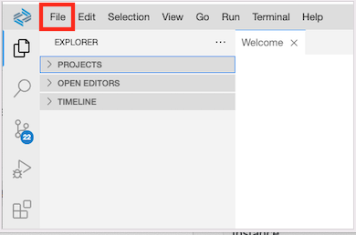

(1) In SAP Business Application Studio, open **File** menu.

(2) Click **New Project from Template**.

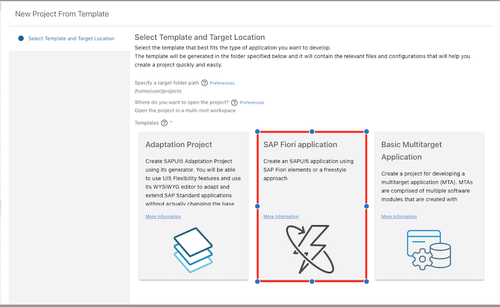

(3) Click **SAP Fiori application**.

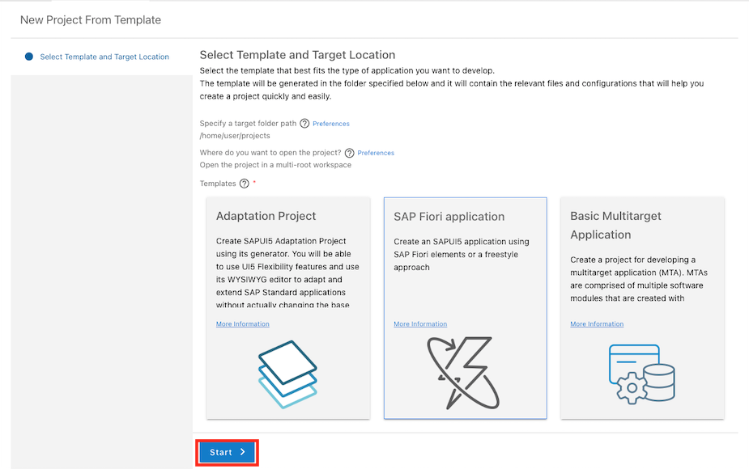

(4) Click **Start**.

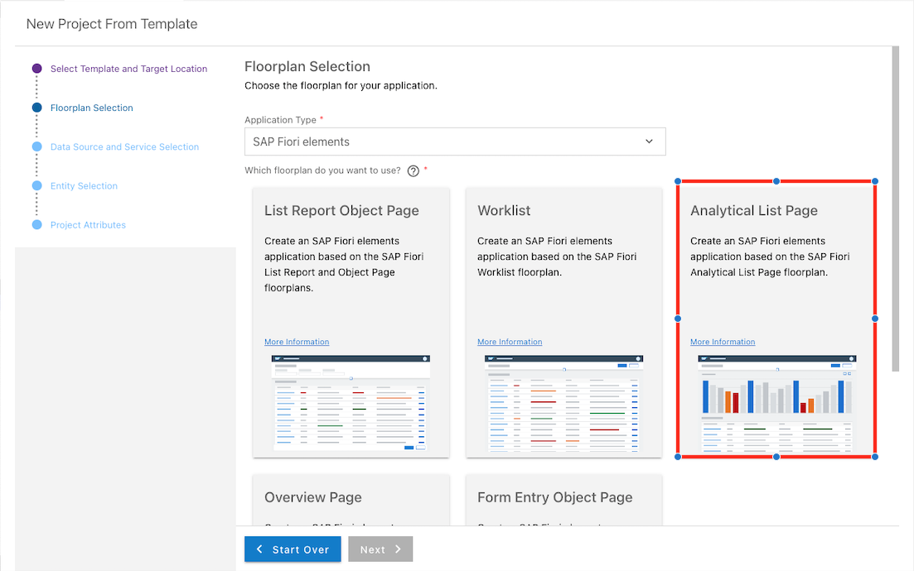

(5) In the template selection, click on the tile **Analytical List Page**.

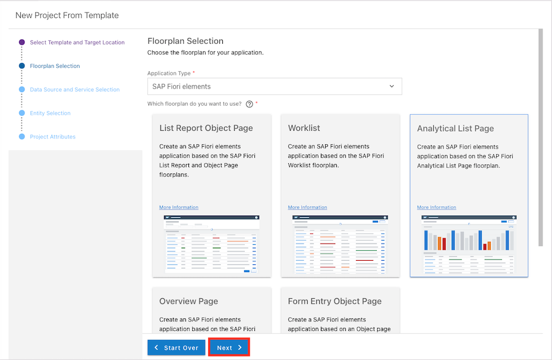

(6) Click **Next**.

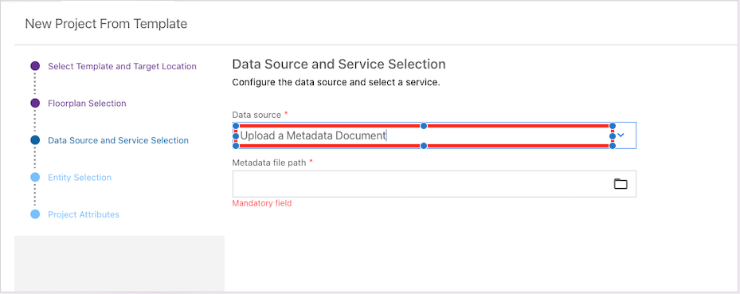

(7) In the step **Datasource and Service Selection**, select **Upload a Metadata Document**.

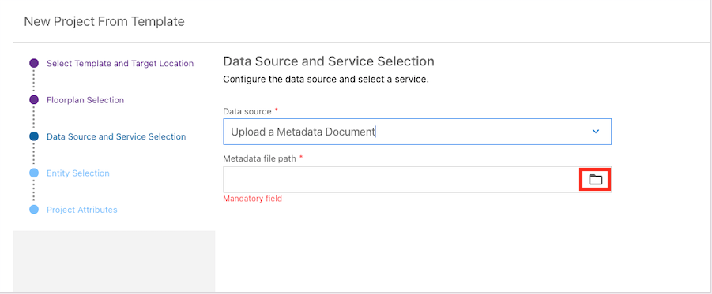

(8) Click **Browse for Files** icon  to select the metadata file from the teched sample scenario folder.

(9) Open the folder hierarchy path
**home-\>user-\>projects-\>teched2020-IIS361-\>exercises-\>ex1-\>resources** and select **metadata.xml**.

(10) Click **Open**.

(11) Click **Next**.

(12) In the **Main entity** drop down, select **Z_SEPMRA_SO_SALESORDERANALYSIS** as main entity. The properties of this entity will be used to display data on Analytical List Report page.

(13) Leave value for drop down **Navigation entity** to **None** since you want to show data of a single instance of the main entity on the object page, too.

Leave value for drop down **Table type** to **Analytical**.

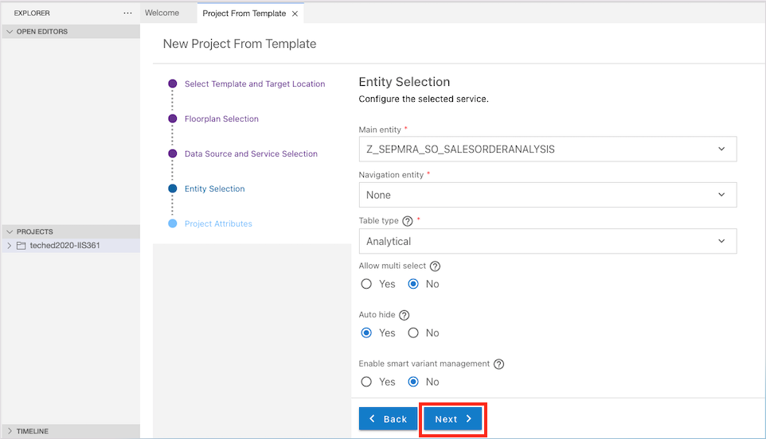

(14) Click **Next**.

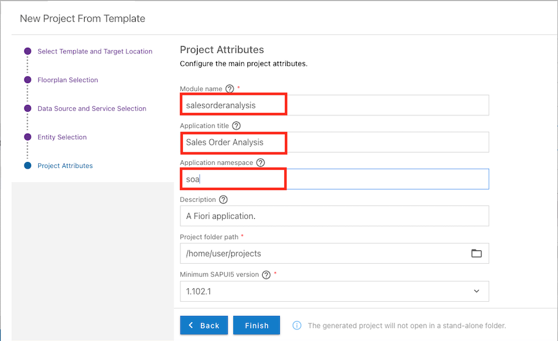

(15) Enter **salesorderanalysis** as module name

(16) Choose an App Title, for example **Sales Order Analysis**.

(17) Enter **soa** as a namespace.

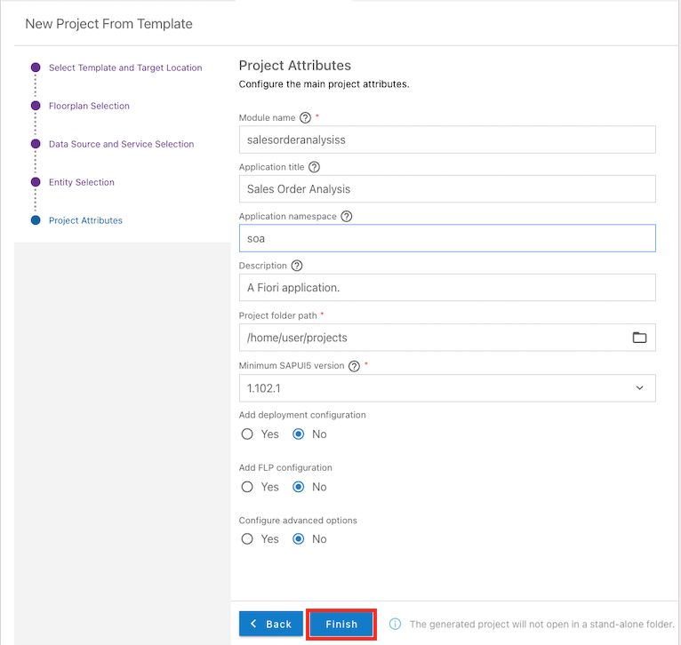

(18) Click **Finish**. The project gets generated.

Exercise 1.2 Importing Mock Data Files
--------------------------------------

As we are working with the mock server in this exercise, you now need to import the sample data files used by this mock server to your project to simulate a real backend server data during the application preview. For this, copy the mockdata folder from the sample project.

When you choose to connect to an OData service or SAP system in step (7), this step is not needed.

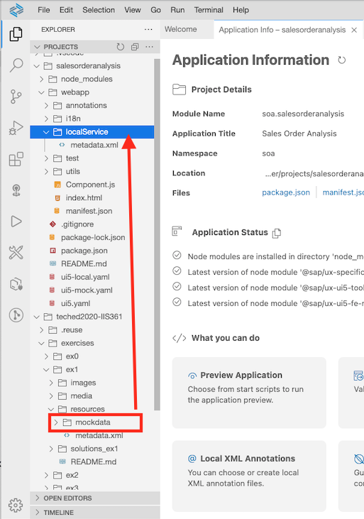

(19) Expand the folder **teched2020-IIS361-\>exercises-\>ex1-\>resources**.

(20) Expand the newly created project folder **salesorderanalysis-\>webapp-\>localService**. Drag the **mockdata** folder to the localService folder in your generated project.

Summary
-------

You have generated a Fiori elements application based on the Analytical List Page and Object Page floorplans. 

**Note**: you can compare the contents of the generated **webapp** folder with the solutions we prepared for you in **home-\>user-\>projects-\>teched2020-IIS361-\>exercises-\>ex1-\>solutions_ex1**. The node_modues folder contains the modules needed for fiori tools used for editing and previewing your application with Fiori tools. Its contents can be generated any time by running the command `npm install` on the application folder.

In the next exercise, you will configure the content of the Alalytical List Page. Continue to [Exercise 2 -- Configuring Content Area of Analytical List Page](../ex2/README.md)
